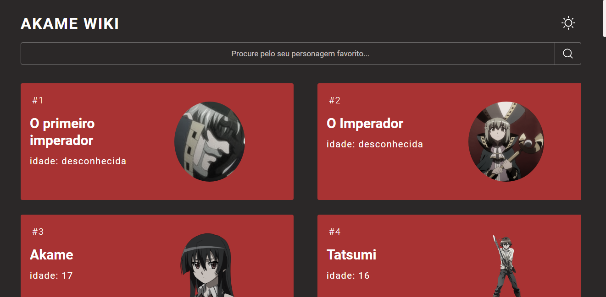

# Akame Wiki




## Introdução

Esse é um site simples criado para consumir a API de Akame ga kill que criei, foi feito utilizando React com styled components e framer motion.

## 💻 Pré-requisito

Antes de começar, verifique se você atendeu ao seguinte requisito:
* Você instalou a versão mais recente do Node.js
* Você iniciou o servidor da API ([clique aqui](https://github.com/EnzoSylvestrin/Akame-API) para ver mais)

## ☕ Usando o Projeto

Para usar o site, siga estas etapas:

utilize o comando:

```
git clone https://github.com/EnzoSylvestrin/Wheater.git
```

abra o projeto pelo visual studio code

então abra o terminal no diretório em que está o projeto e utilize o comando:

```
npm i --save
```

inicie o serivdor com o comando:

```
npm start
```
